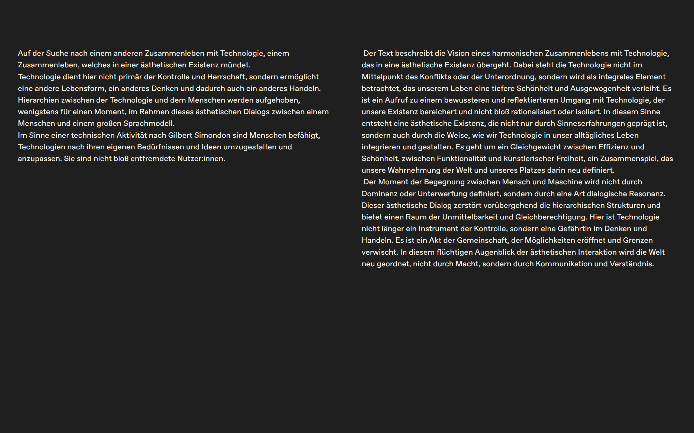

# Interface

## Examples

### Mattis Kuhn – neither host nor guest (2024/25)

[Project page](https://mattiskuhn.com/neither-host-nor-guest-performance/)

> »neither host nor guest« is an aesthetic human-AI dialog in the mode of archaic friendliness, as expressed in the Zen phrase „neither host nor guest / host and guest apparently“. There is no distinction between host and guest, between I and you, between human and AI, but a relationship of openness and indifference.
>
> The form of archaic friendliness is simulated in a large language model (LLM) and realized through an interface of simultaneity in the interaction between human and LLM. The project seeks forms of a human-machine relationship that is less characterized by thinking in distinctions, that aims less at control and domination by means of technology, but sees technology as part of an aesthetic existence. 

```{margin}
Mattis Kuhn – neither host nor guest (2024/25)<br>LLM (Mistral Small), system prompt, custom web interface

```


```{margin}
Mattis Kuhn – neither host nor guest (2024/25)<br>LLM (Mistral Small), system prompt, custom web interface

```


## Frameworks

[Gradio](https://www.gradio.app)

[LibreChat](https://www.librechat.ai/)

[Chainlit](https://chainlit.io/)

[Streamlit](https://streamlit.io)

https://docs.streamlit.io/develop/tutorials/chat-and-llm-apps/build-conversational-apps

[ollama-ui](https://github.com/ollama-ui/ollama-ui) — simple http interface, good for customization


https://blog.streamlit.io/build-a-chatbot-with-custom-data-sources-powered-by-llamaindex/

https://docs.streamlit.io/get-started/fundamentals/main-concepts


https://docs.llamaindex.ai/en/stable/module_guides/deploying/chat_engines/

https://huggingface.co/docs/chat-ui/index

