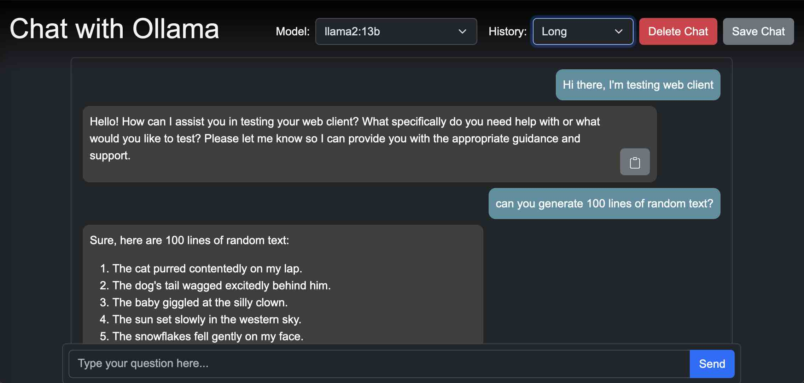

# Interface: Dream Interpreter (with ollama-ui)

```{margin}
ollama-ui (default interface)<br>
[Source](https://github.com/ollama-ui/ollama-ui)
```


[github](https://github.com/ollama-ui/ollama-ui)

```shell
git clone https://github.com/ollama-ui/ollama-ui
cd ollama-ui
rm -r .git*  # confirm with 'y'
make

open http://localhost:8000 # in browser
```

The interface has several drop-down fields for selecting the model, defining a system prompt etc. We want to reduce this functionality to serve only the purpose of interpreting our dreams.

Remove the select menu from `index.html`:


Change the placeholder "Type your question here ..."

Open `chat.js` and set a fixed model and remove the system prompt:


Optional: Remove the copy button (`let copyButton` and the following lines).

Modify the style of the page (`chat.css`) by hand or with your favorite chatbot. Best save it as a new file like `dreamy.css` and change the corresponding section in `index.html`:


