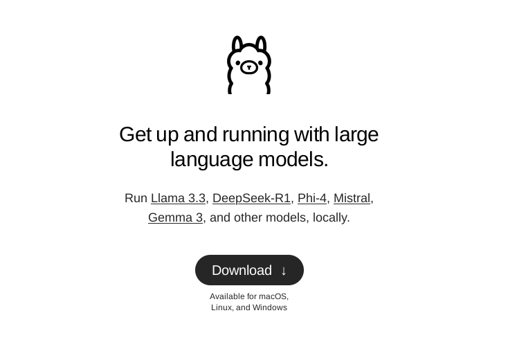

# Ollama



Visit https://ollama.com and install it. 

Terminal commands:

```
# help 
ollama -h 

# run (or download) a model 
ollama run [MODELNAME]

```

We'll start with Mistral (7B) https://ollama.com/library/mistral 

```
ollama run mistral
```

## System Prompt 


## Modelfile 

TODO:

- system prompt 
- Modelfile erstellen https://github.com/ollama/ollama/blob/main/docs/modelfile.md